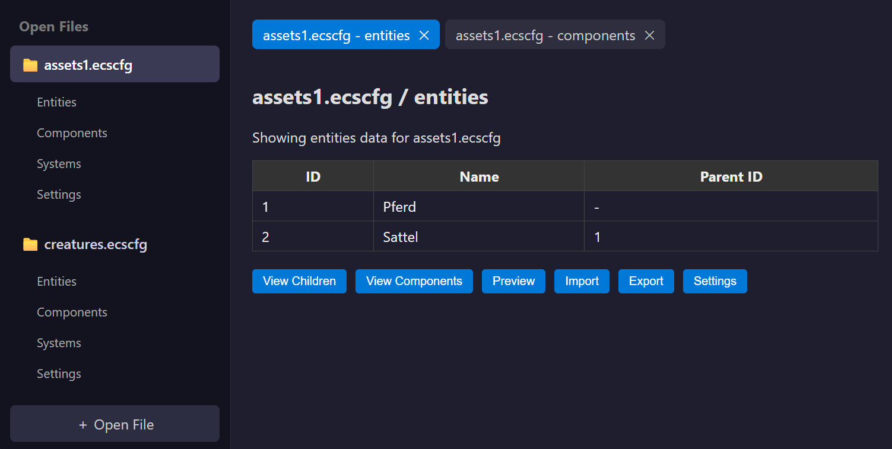

# ❄️ ECS Studio – Website

This repository contains the public landing page and download site for **ECS Studio**.

**ECS Studio** is a visual editor for structured entity-component system (ECS) assets with support for `.ecscfg` configuration files, component previews (e.g. `.png`, `.gltf`), and hierarchical asset structures.

## 🌐 Live Site

👉 [Visit ECS Studio Website](https://chevp.github.io/ecs-studio-site/)

## Preview

## 📁 Contents

- `index.html` – main landing page  
- `impressum.html` – legal information  
- `installer/` – folder containing the `.msi` installer  
- (Optional) `assets/` – logos, screenshots, etc.

## 📦 Download

The latest Windows installer is available directly on the site via the **Download** button.

## ⚠️ Notes

This repository contains only the website.  
The actual ECS Studio application source code is private and maintained separately.

## 📄 License

Website content is © 2025 Chevillat P. All rights reserved.
